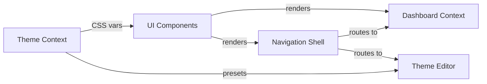
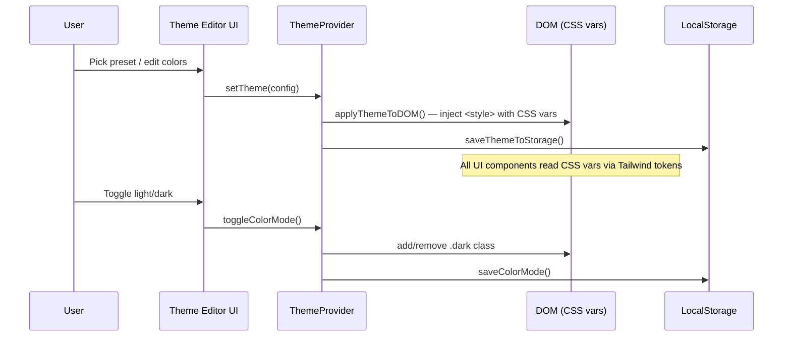
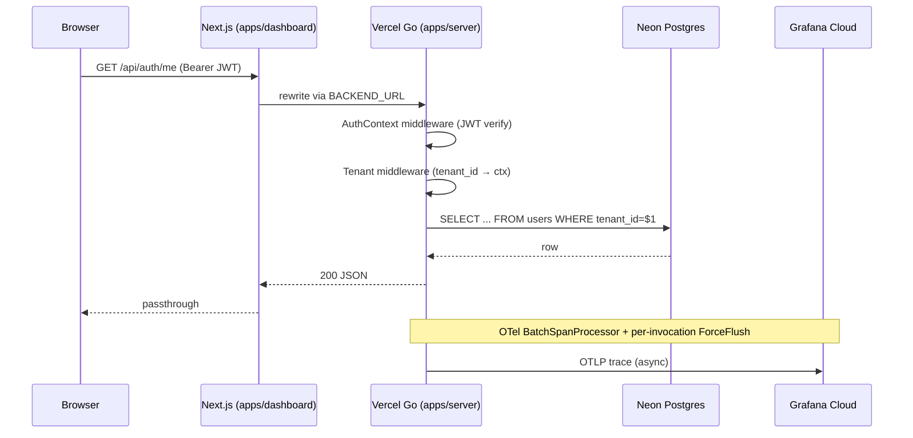

# Architecture — Whitelabel Admin

## Domain Model

### Core Domains
- **Theming**: The central product domain. Manages color tokens (OKLch), theme presets, light/dark mode, typography, spacing, shadows. Persisted to localStorage. This is the product's primary value proposition — white-label customization.
- **Auth**: JWT (RS256) access + refresh flow with HttpOnly refresh cookie. Revocation via `refresh_blacklist` table. Per-tenant scoping + role-based permissions (admin / editor / viewer) seeded on migration.
- **Backend Service**: Go serverless handler (`apps/server/api/catchall.go`) on Vercel Go runtime (`@vercel/go@3.5.0`). chi router delegates to package handlers; pgx pool connects to Neon Postgres; OTel traces export to Grafana Cloud Tempo. Proxied from the dashboard via Next.js rewrites.
- **Dashboard**: Admin overview with stat cards. Backed by real `/api/*` endpoints via the BACKEND_URL rewrite.
- **Navigation**: Sidebar + header shell with breadcrumbs, search, user menu, color mode toggle, RBAC-gated nav items.
- **UI Components**: Shared component library (`@whitelabel/ui`) with 60+ shadcn v4 components, framework-agnostic.

### Bounded Contexts


### Aggregate Roots
| Aggregate | Key Entities | Invariants |
|-----------|-------------|------------|
| ThemeConfig | ColorTokens (light), ColorTokens (dark), radius, typography, adjustments | Valid OKLch values, light+dark always paired, 53 color tokens per mode |
| ThemePreset | name, light, dark, radius, category | Unique name, valid category tag |
| ColorMode | "light" \| "dark" | Only two states, persisted independently from theme |

## System Architecture

### Tech Stack
| Layer | Technology | Version |
|-------|-----------|---------|
| Framework | Next.js (App Router, Turbopack) | 16.x |
| Language | TypeScript (strict) | 5.7+ |
| Styling | Tailwind CSS | v4 |
| UI Library | shadcn/ui (via @whitelabel/ui) | v4.1 |
| Component Primitives | @base-ui/react | 1.3+ |
| Icons | lucide-react | 1.6+ |
| Charts | recharts | 3.8 |
| Color System | OKLch (perceptual uniform) | — |
| Font | Geist Sans (Google Fonts) | — |
| Package Manager | pnpm (workspace) | 10+ |
| Runtime | Node.js | 20+ |
| Backend language | Go | 1.25+ |
| Backend HTTP router | chi/v5 | — |
| Backend DB driver | pgx/v5 (`database/sql` + pgxpool) | — |
| Database | Neon Postgres | pg 17 |
| Backend deploy | Vercel Go serverless (`@vercel/go@3.5.0`) | — |
| Frontend deploy | Vercel (Next.js preset) | — |
| API proxy | Next.js `rewrites()` → `BACKEND_URL` | — |
| Auth | JWT RS256, HttpOnly refresh cookie, Postgres JTI blacklist | — |
| Observability (BE) | OpenTelemetry → Grafana Cloud Tempo | `@vercel/go@3.5.0` |
| Observability (FE) | Grafana Faro Web SDK | `@grafana/faro-web-sdk` |
| Migrations | golang-migrate v4 (`cmd/migrate`) | — |
| Theme persistence (client) | localStorage | — |
| Dark mode | CSS class strategy (.dark) | — |

### Data Flow

#### Theme (client-side)


#### API (server-side)


### Deployment Topology

```
GitHub: liyoclaw1242/whitelabel-admin (branch: main, tags: v*)
  │ push to main
  │ ┌──────────────────────────────────────────────────────┐
  │ │ Ignored Build Step (per-project path filter)         │
  │ └──────────────────────────────────────────────────────┘
  │       │                                │
  ▼       ▼                                ▼
Vercel project: whitelabel-admin-server   Vercel project: whitelabel-admin-dashboard
  rootDirectory: apps/server               rootDirectory: apps/dashboard
  framework: Other (Go)                    framework: Next.js
  alias: whitelabel-admin-api.vercel.app   alias: whitelabel-admin-dashboard.vercel.app
  env: DATABASE_URL, JWT_*, OTEL_*         env: BACKEND_URL, NEXT_PUBLIC_GRAFANA_FARO_*
  ↓                                         ↓
Neon Postgres (ap-southeast-1)            Grafana Cloud Faro (ap-northeast-0)
  branches: main / preview / dev           +  Tempo (traces)  +  Loki (logs)
```

Tag pushes trigger `.github/workflows/release.yml` (full CI → migrate-prod
→ smoke). Regular branch pushes to `main` also run `migrate.yml`
(preview migrate → smoke → prod migrate → post-migrate health) and the
git-linked auto-deploys kick off both Vercel projects in parallel.

### Folder Structure
```
whitelabel-admin/
  apps/
    dashboard/                    # Next.js App Router app — rootDirectory of whitelabel-admin-dashboard
      src/
        app/
          layout.tsx              # Root layout (Geist font, ThemeProvider, AuthProvider, FaroProvider)
          globals.css             # Tailwind v4, CSS vars (light + dark)
          login/page.tsx          # unauth'd entry — calls /api/auth/login
          (dashboard)/
            layout.tsx            # Sidebar + header shell, RBAC-gated nav
            page.tsx              # Home/overview with stat cards
            users/, theme-editor/ # feature pages
        lib/
          auth-store.tsx          # AuthProvider, useAuth — login / logout (calls /api/auth/logout) / hasPermission
          api.ts                  # apiFetch with ProblemError and Bearer token injection
        components/providers/
          FaroProvider.tsx        # initializes @grafana/faro-web-sdk on mount
      next.config.ts              # rewrites /api/:path* → ${BACKEND_URL}/api/:path*
      vercel.json                 # (none — uses dashboard project config + auto-detect)

    server/                       # Go backend — rootDirectory of whitelabel-admin-server
      api/
        catchall.go               # Vercel Go entry (Handler). Wires pgxpool + repos + JWT + blacklist, delegates to chi.
      cmd/
        api/main.go               # local dev entry (net/http ListenAndServe); NOT used in Vercel deploy
        migrate/main.go           # golang-migrate CLI (`go run ./cmd/migrate up|down|version|force`)
        keygen/main.go            # produces an RS256 keypair (PEM) on stdout
      pkg/                        # shared packages — NOT internal/, Vercel Go builder rejects internal/
        auth/                     # KeyPair (LoadKeyPair, Sign, VerifyRefresh), Claims, RefreshClaims
        authapi/                  # /api/auth/login, /refresh, /logout, /me handlers
        blacklist/                # Store interface; Memory (local dev) + Postgres (prod, refresh_blacklist)
        db/                       # Open (database/sql), OpenPool (pgxpool), PoolPinger (health.Pinger)
        health/                   # Handler returning {status, db}
        httperr/                  # RFC 7807 problem+json responses
        logging/                  # slog handler config
        middleware/               # OTel, AuthContext, Tenant, Audit, RateLimit, RBAC
        otel/                     # Provider wraps otlptracehttp + BatchSpanProcessor + ForceFlush
        repo/                     # UserRepo/TenantRepo/AuditRepo interfaces; memory/ + pgx/ impls
        router/                   # chi-based NewWithDeps(Deps) — mounts routes when deps present
      migrations/                 # 10 .up/.down SQL files (tenants/users/roles/perms/items/audit/seed/blacklist)
      vercel.json                 # functions: api/catchall.go runtime @vercel/go@3.5.0
      go.mod / go.sum

    storybook/                    # Storybook 8 + React + Vite — rootDirectory of whitelabel-storybook
      .storybook/main.ts, preview.tsx
      src/stories/{atoms,forms,layout}/

  packages/
    ui/                           # @whitelabel/ui — shared component library
      src/
        components/
          theme-provider.tsx      # ThemeContext, ThemeProvider
          ui/                     # 60+ shadcn v4 components
        hooks/use-theme.ts, use-mobile.ts
        lib/theme-config.ts, theme-presets.ts (42 presets, 5177 lines), utils.ts
        index.ts
    otel/                         # @whitelabel/otel — shared OTel config for dashboard

  docs/
    runbook.md                    # On-call procedures (JWT rotation, PITR, forced logout-all)
    grafana/                      # 2 dashboards + 6 alert rules (provisioned via API, see #194)
    ops/                          # secret-inventory, secret-rotation, dr-drill-template, neon-branch mgmt
    decisions/                    # ADRs — vercel-go-otel-lifecycle, otel-naming, sentry-to-faro
  .github/workflows/
    ci.yml                        # lint + typecheck + Go build/test + vitest + Playwright
    migrate.yml                   # push → preview migrate → smoke → prod migrate → health
    release.yml                   # tag → CI → migrate-prod → deploy → smoke
    e2e.yml                       # Playwright against preview
    stale-branch-cleanup.yml
```

> `internal/` (Go's visibility-gated dir) is intentionally **not** used
> in `apps/server/`. Vercel's Go builder wraps each handler in a
> generated main package whose file path trips Go's internal/
> visibility rule and the build fails. Everything shared lives under
> `pkg/` instead.

## API Contracts

### Backend Endpoints (Go — `apps/server`)
| Method | Path | Purpose | Auth |
|--------|------|---------|------|
| GET | /api/health | DB ping + status | No |
| POST | /api/auth/login | email+password → access JWT + refresh cookie | No (rate-limited 5/min per IP+email) |
| POST | /api/auth/refresh | refresh cookie → new access JWT | Cookie only |
| POST | /api/auth/logout | blacklist refresh JTI + clear cookie | Cookie only |
| GET | /api/auth/me | current user + roles + permissions | Bearer JWT |

All error responses follow RFC 7807 (`application/problem+json`) with a
`trace_id` field populated from the active OTel span.

> **Type sharing strategy**: OpenAPI spec at `docs/api/openapi.yaml`,
> TypeScript types generated via `pnpm gen:api-types` into
> `apps/dashboard/src/lib/api-types.ts`.

### Internal APIs (React Context)
| Hook/Context | Method | Purpose |
|-------------|--------|---------|
| useTheme() | theme | Get current ThemeConfig |
| useTheme() | setTheme(config) | Apply + persist a theme |
| useTheme() | presets | List all available presets |
| useTheme() | colorMode | Get current "light" \| "dark" |
| useTheme() | toggleColorMode() | Switch between light/dark |
| useTheme() | setColorMode(mode) | Set specific color mode |

### Theme Persistence
| Key | Storage | Format |
|-----|---------|--------|
| `whitelabel-theme` | localStorage | JSON ThemeConfig |
| `whitelabel-color-mode` | localStorage | "light" \| "dark" |

## User Journey Map

### Primary Flows
1. **First Visit**: Landing → Home (overview with stat cards) → Sidebar navigation
2. **Theme Customization**: Home → Theme Editor → Pick preset / edit colors → Preview → Save
3. **Navigation**: Sidebar (Home, Dashboard, Users, Theme Editor, Settings) + header breadcrumbs

### Defined Routes (from nav)
| Route | Status | Purpose |
|-------|--------|---------|
| `/` | Implemented | Home overview with stat cards |
| `/dashboard` | Placeholder | Dashboard (stub) |
| `/users` | Placeholder | User management (stub) |
| `/theme-editor` | Implemented | Theme customization (colors, typography, presets, preview) |
| `/settings` | **Removed** (2026-04-07, #77) | Redundant — theme-editor covers this |

### Key Decision Points
| Step | User Decision | System Response |
|------|--------------|-----------------|
| Preset selection | Pick from 42+ presets (grid, filter by category, search) | Apply all CSS vars + radius immediately |
| Color editing | Modify individual OKLch tokens per light/dark | Live preview, persist to localStorage |
| Mode toggle | Switch light/dark | Toggle .dark class, persist preference |
| Typography | Adjust font, letter spacing | Apply via CSS custom properties |
| Spacing/Shadow | Adjust multiplier, shadow intensity | Apply via CSS custom properties |

## Product Roadmap Context

### Current Phase
Long-term product (not MVP). Theme editor is the core feature. Dashboard, Users are placeholders. Building production infrastructure.

### Recent Decisions
- 2026-03-25: shadcn v4 + @base-ui/react as component primitives
- 2026-03-25: OKLch color system for perceptual uniformity
- 2026-03-25: Schoger ring technique (`ring-1 ring-foreground/[0.08]`) over solid borders
- 2026-03-26: Dual light/dark ThemeConfig (both modes stored per theme, not separately)
- 2026-03-31: 42 tweakcn presets imported with category tags
- 2026-04-09: OTel-first monitoring — raw `@opentelemetry/sdk-node` in dashboard, `otlptracehttp` in server. Grafana Cloud as managed OTLP backend
- 2026-04-14: Go backend on Vercel Serverless (#100) — chi router, Next.js rewrites as API proxy, OpenAPI for type sharing
- 2026-04-15: Sentry removed (dashboard) → Grafana Faro Web SDK
- 2026-04-18: Split deploy into two Vercel projects (`whitelabel-admin-server` + `whitelabel-admin-dashboard`) — each git-linked with an Ignored Build Step path filter so changes in one app don't rebuild the other
- 2026-04-18: `apps/server/internal/` → `apps/server/pkg/` (Vercel Go builder breaks on `internal/`)
- 2026-04-19: DB platform finalized on Neon Postgres (was Turso/LibSQL in early plan) — pooled connection per branch via `-pooler` host, pgx/v5 via `database/sql`
- 2026-04-19: Refresh-token blacklist moved from planned Cloudflare KV to Postgres (`refresh_blacklist` table, migration 000010) — one fewer vendor, one fewer token to rotate

### Known Tech Debt
| Item | Impact | Priority |
|------|--------|----------|
| BE exports traces only; no metrics exporter | 3 of 6 alert rules in `docs/grafana/alerting-rules.json` still error on `rate()` + expression shape | Medium |
| BE stdout not shipped to Loki | 2 log-based alerts depend on strings the app doesn't log | Medium |
| Static stat card data | Dashboard is non-functional beyond visual demo | Low |
| `users:write` permission not wired (seed uses `users:read/create/update/delete` granular set) | Existing dashboard permission checks may look for the wrong key | Low |
| LegacyThemeConfig migration code | Dead weight once all clients migrated | Low |
| Duplicated ColorTokens interface in theme-presets.ts | Should import from theme-config.ts | Low |

### Planned Features (from nav structure)
| Feature | Domain Impact | Dependencies |
|---------|--------------|-------------|
| OTel + Sentry monitoring (#81-#84) | New `packages/otel` context, `instrumentation.ts` | In progress — Phase 1 |
| Dashboard (real data) | New Data context, API routes | Backend, database |
| User management | New User aggregate, CRUD | Auth, backend, database |
| ~~Settings page~~ | ~~Removed 2026-04-07~~ | Redundant — theme-editor is sufficient |
| Theme export/import | File generation | Theme system extension |
| Multi-tenant support | Tenant isolation, auth scoping | Auth, database, major architecture change |

## Design System

See `design-decisions.md` for the full canonical record. Key principles:
- **Color**: OKLch for perceptual uniformity, achromatic default, brand hue via presets
- **Borders**: Schoger ring technique (`ring-1 ring-foreground/[0.08]`), never solid `border` on outer containers
- **Typography**: Geist Sans, eyebrow labels (`text-xs font-medium uppercase tracking-widest font-mono`), tight tracking on headings
- **Layout**: Eyebrow > heading > description pattern, `space-y-8` between sections
- **Accessibility**: `aria-label` on icon buttons, OKLch lightness for contrast, focus-visible rings

## Failure Modes

| Service Boundary | Failure | Detection | Recovery | User Impact |
|-----------------|---------|-----------|----------|-------------|
| localStorage | Storage full or unavailable | try/catch in save functions | Silently ignore, theme still works in-memory | Theme resets on page reload |
| localStorage | Corrupt JSON | try/catch in load, returns null | Falls back to defaultTheme | Loses customization |
| CSS injection | `<style>` element fails | — | Theme vars fall back to globals.css defaults | Visual glitch, recoverable on reload |
| Legacy migration | Old single-mode config in storage | `migrateLegacyTheme()` auto-converts | Converts to dual-mode, dark falls back to defaults | Dark mode may look different than expected |
| Go server | Cold start | First request in a new instance pays OTel SDK + pgx pool init | Amortised across warm requests via `sync.Once` in catchall.go | First request may take 500-1500ms; subsequent ones <500ms |
| Go server | Crash/OOM | Vercel function invocation error | Auto-retry on next invocation (stateless) | API calls return 502 briefly |
| Go server | Neon unreachable | `/api/health` returns 503 `{"db":"not_configured"}` or error; pgx queries return pool timeout | Retry with backoff; Neon serverless compute auto-wakes | Auth endpoints degraded (no user lookup); health endpoint still answers structurally |
| Go server | Refresh blacklist table missing (migration not run) | `refresh_blacklist` INSERT fails → logout returns 500 | Run `go run ./cmd/migrate up` | Logout doesn't blacklist; tokens stay valid until natural expiry |
| Next.js proxy | `BACKEND_URL` missing | Build warning; `rewrites()` returns `[]` | Frontend /api/* calls resolve to Next.js (likely 404) | API features unavailable; theme-editor still works (client-side) |
| Vercel Serverless | Region outage | Vercel status page | Manual failover or wait | API unavailable, frontend unaffected (static pages still served from edge) |
| OTel OTLP exporter | Grafana Cloud unreachable | `ForceFlush` per request exceeds 2s budget and warn-logs | Spans dropped silently; request still succeeds | No traces during outage; app traffic unaffected |
