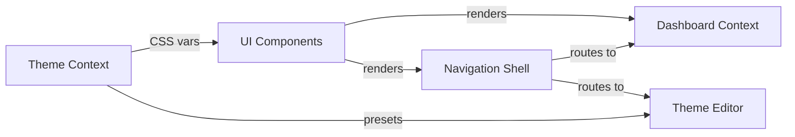
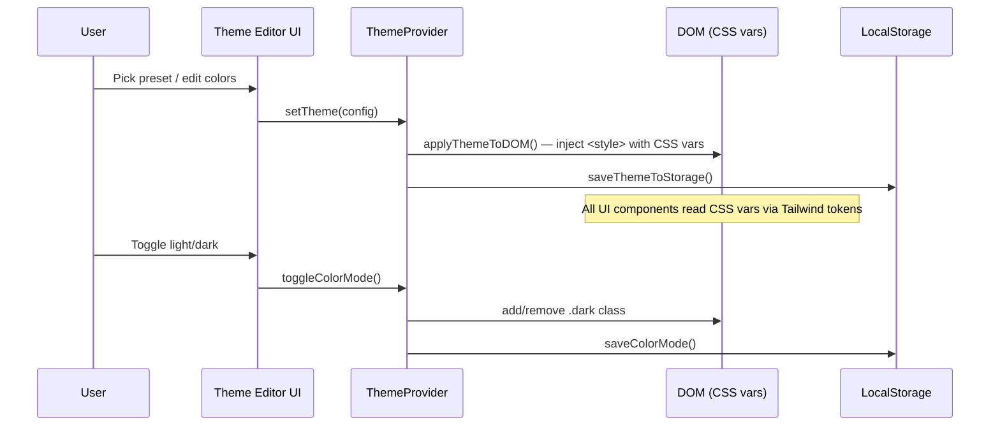

# Architecture — Whitelabel Admin

## Domain Model

### Core Domains
- **Theming**: The central domain. Manages color tokens (OKLch), theme presets, light/dark mode, typography, spacing, shadows. Persisted to localStorage. This is the product's primary value proposition — white-label customization.
- **Dashboard**: Admin overview with stat cards (users, activity, revenue, pending). Currently static/hardcoded data.
- **Navigation**: Sidebar + header shell with breadcrumbs, search, user menu, color mode toggle.
- **UI Components**: Shared component library (`@whitelabel/ui`) with 60+ shadcn v4 components, framework-agnostic.

### Bounded Contexts


### Aggregate Roots
| Aggregate | Key Entities | Invariants |
|-----------|-------------|------------|
| ThemeConfig | ColorTokens (light), ColorTokens (dark), radius, typography, adjustments | Valid OKLch values, light+dark always paired, 53 color tokens per mode |
| ThemePreset | name, light, dark, radius, category | Unique name, valid category tag |
| ColorMode | "light" \| "dark" | Only two states, persisted independently from theme |

## System Architecture

### Tech Stack
| Layer | Technology | Version |
|-------|-----------|---------|
| Framework | Next.js (App Router) | canary |
| Language | TypeScript (strict) | 5.7+ |
| Styling | Tailwind CSS | v4 |
| UI Library | shadcn/ui (via @whitelabel/ui) | v4.1 |
| Component Primitives | @base-ui/react | 1.3+ |
| Icons | lucide-react | 1.6+ |
| Charts | recharts | 3.8 |
| Color System | OKLch (perceptual uniform) | — |
| Font | Geist Sans (Google Fonts) | — |
| Package Manager | pnpm (workspace) | 9+ |
| Runtime | Node.js | 20+ |
| Persistence | localStorage (client-side) | — |
| Dark Mode | CSS class strategy (.dark) | — |

### Data Flow


### Folder Structure
```
whitelabel-admin/
  apps/
    dashboard/                    # Next.js App Router app
      src/
        app/
          layout.tsx              # Root layout (Geist font, ThemeProvider)
          globals.css             # Tailwind v4, CSS vars (light + dark)
          (dashboard)/
            layout.tsx            # Sidebar + header shell (client component)
            page.tsx              # Home/overview with stat cards
    storybook/                    # Storybook 8 + React + Vite (planned, see #85)
      .storybook/                 # main.ts, preview.tsx (ThemeProvider decorator + toolbar)
      src/
        styles.css                # mirrors dashboard globals.css for Tailwind v4
        stories/{atoms,forms,layout}/ # *.stories.tsx — one per @whitelabel/ui component
  packages/
    ui/                           # @whitelabel/ui — shared component library
      src/
        components/
          theme-provider.tsx      # ThemeContext, ThemeProvider
          ui/                     # 60+ shadcn v4 components
        hooks/
          use-theme.ts            # useTheme hook
          use-mobile.ts           # useIsMobile hook
        lib/
          theme-config.ts         # ThemeConfig type, color tokens, presets, DOM helpers
          theme-presets.ts        # 42 tweakcn presets with categories (5177 lines)
          utils.ts                # cn() utility
        index.ts                  # Public API barrel export
```

## API Contracts

### Existing Endpoints
No backend API routes yet. The app is entirely client-side with localStorage persistence.

### Internal APIs (React Context)
| Hook/Context | Method | Purpose |
|-------------|--------|---------|
| useTheme() | theme | Get current ThemeConfig |
| useTheme() | setTheme(config) | Apply + persist a theme |
| useTheme() | presets | List all available presets |
| useTheme() | colorMode | Get current "light" \| "dark" |
| useTheme() | toggleColorMode() | Switch between light/dark |
| useTheme() | setColorMode(mode) | Set specific color mode |

### Theme Persistence
| Key | Storage | Format |
|-----|---------|--------|
| `whitelabel-theme` | localStorage | JSON ThemeConfig |
| `whitelabel-color-mode` | localStorage | "light" \| "dark" |

## User Journey Map

### Primary Flows
1. **First Visit**: Landing → Home (overview with stat cards) → Sidebar navigation
2. **Theme Customization**: Home → Theme Editor → Pick preset / edit colors → Preview → Save
3. **Navigation**: Sidebar (Home, Dashboard, Users, Theme Editor, Settings) + header breadcrumbs

### Defined Routes (from nav)
| Route | Status | Purpose |
|-------|--------|---------|
| `/` | Implemented | Home overview with stat cards |
| `/dashboard` | Placeholder | Dashboard (stub) |
| `/users` | Placeholder | User management (stub) |
| `/theme-editor` | Implemented | Theme customization (colors, typography, presets, preview) |
| `/settings` | **Removed** (2026-04-07, #77) | Redundant — theme-editor covers this |

### Key Decision Points
| Step | User Decision | System Response |
|------|--------------|-----------------|
| Preset selection | Pick from 42+ presets (grid, filter by category, search) | Apply all CSS vars + radius immediately |
| Color editing | Modify individual OKLch tokens per light/dark | Live preview, persist to localStorage |
| Mode toggle | Switch light/dark | Toggle .dark class, persist preference |
| Typography | Adjust font, letter spacing | Apply via CSS custom properties |
| Spacing/Shadow | Adjust multiplier, shadow intensity | Apply via CSS custom properties |

## Product Roadmap Context

### Current Phase
Long-term product (not MVP). Theme editor is the core feature. Dashboard, Users are placeholders. Building production infrastructure.

### Recent Decisions
- 2026-03-25: shadcn v4 + @base-ui/react as component primitives
- 2026-03-25: OKLch color system for perceptual uniformity
- 2026-03-25: Schoger ring technique (`ring-1 ring-foreground/[0.08]`) over solid borders
- 2026-03-26: Dual light/dark ThemeConfig (both modes stored per theme, not separately)
- 2026-03-31: 42 tweakcn presets imported with category tags
- 2026-04-01: Preset selector with grid, category filter, search
- 2026-04-09: OTel-first log monitoring (#80) — raw `@opentelemetry/sdk-node` (not `@vercel/otel`), `packages/otel` shared config, Sentry for client-side errors, Axiom or Grafana Cloud as managed OTLP backend

### Known Tech Debt
| Item | Impact | Priority |
|------|--------|----------|
| No test coverage at all | Regressions undetectable | High |
| No backend/database | Can't persist across devices, no multi-user | Medium |
| No auth system | Can't protect admin routes | Medium |
| Static stat card data | Dashboard is non-functional beyond visual demo | Low |
| LegacyThemeConfig migration code | Dead weight once all clients migrated | Low |
| Duplicated ColorTokens interface in theme-presets.ts | Should import from theme-config.ts | Low |

### Planned Features (from nav structure)
| Feature | Domain Impact | Dependencies |
|---------|--------------|-------------|
| OTel + Sentry monitoring (#81-#84) | New `packages/otel` context, `instrumentation.ts` | In progress — Phase 1 |
| Dashboard (real data) | New Data context, API routes | Backend, database |
| User management | New User aggregate, CRUD | Auth, backend, database |
| ~~Settings page~~ | ~~Removed 2026-04-07~~ | Redundant — theme-editor is sufficient |
| Theme export/import | File generation | Theme system extension |
| Multi-tenant support | Tenant isolation, auth scoping | Auth, database, major architecture change |

## Design System

See `design-decisions.md` for the full canonical record. Key principles:
- **Color**: OKLch for perceptual uniformity, achromatic default, brand hue via presets
- **Borders**: Schoger ring technique (`ring-1 ring-foreground/[0.08]`), never solid `border` on outer containers
- **Typography**: Geist Sans, eyebrow labels (`text-xs font-medium uppercase tracking-widest font-mono`), tight tracking on headings
- **Layout**: Eyebrow > heading > description pattern, `space-y-8` between sections
- **Accessibility**: `aria-label` on icon buttons, OKLch lightness for contrast, focus-visible rings

## Failure Modes

| Service Boundary | Failure | Detection | Recovery | User Impact |
|-----------------|---------|-----------|----------|-------------|
| localStorage | Storage full or unavailable | try/catch in save functions | Silently ignore, theme still works in-memory | Theme resets on page reload |
| localStorage | Corrupt JSON | try/catch in load, returns null | Falls back to defaultTheme | Loses customization |
| CSS injection | `<style>` element fails | — | Theme vars fall back to globals.css defaults | Visual glitch, recoverable on reload |
| Legacy migration | Old single-mode config in storage | `migrateLegacyTheme()` auto-converts | Converts to dual-mode, dark falls back to defaults | Dark mode may look different than expected |
